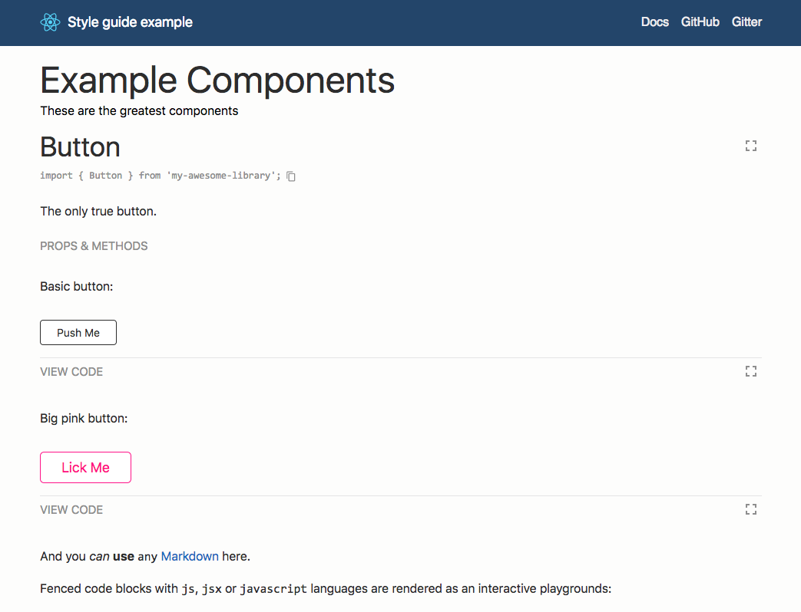

# React Styleguidist customized example style guide



How to start locally:

```
git clone https://github.com/styleguidist/react-styleguidist.git
cd react-styleguidist/examples/customised
npm install
npm run styleguide
```

Then open [http://localhost:6060](http://localhost:6060) in your browser.
